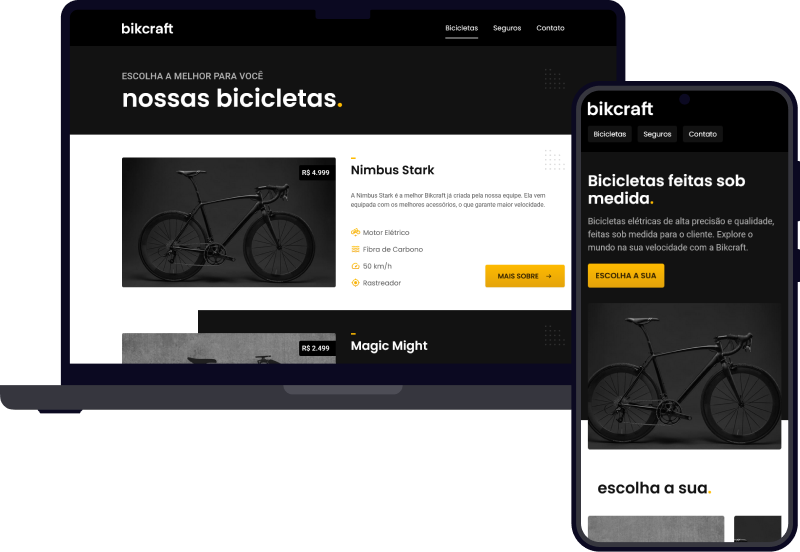

<h1 align="center"></h1>

  
  
  
  

  

 

## 🚀 Tecnologias

Esse projeto foi desenvolvido com as seguintes tecnologias:

- HTML e CSS
- JavaScript
- Git e Github
- Figma

 

## 💻 Projeto

Projeto desenvolvido durante os cursos de UI Design para Iniciantes e HTML e CSS da Origamid
- [Visite o Projeto online](https://jfmacedo91.github.io/bikcraft/)

 

## 💛 Feito por Jean Fernandes de Macedo

